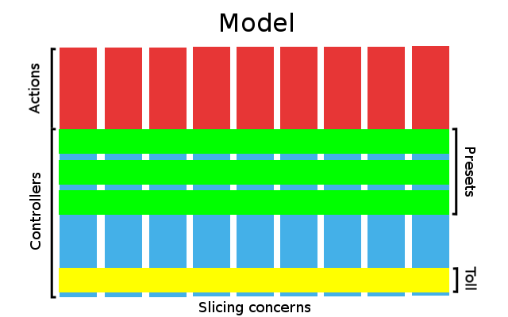

Model-Action Framework
======================

A **model** is an abstract software definition of user needs. A well-defined model is actionable to both users and developers. Users **act** on models. In harubi, a model is *vertically* sliced into a set of unique implementable actions. The word vertical is also an abstract definition. We will discuss vertical and horizontal slices shortly. An **action** is a definition to implement a **controller** which is a software code serving a user's action. An action can be named using a simple phrase such as *sign-up, sign-in, sign-out, etc.* so that to give a clear indication of what a controller must do. A controller may process inputs, persist data, trigger external systems, or do anything in the realm of software. A controller responds exactly to a user request through the user action.

Generally, a model manifests a collection of controllers. An action manifests a vertical slice of controller. A vertical slice is a top-down process where a user's action at the top is carried out by a controller down to the bottom of a system. It will respond exactly to a user request through an action. However, a controller may need to handle few tasks that need to be applied *across* all actions such as access-control and logging. Hence, a *horizontal* slice is referring to a task across all controllers. A horizontal action may need to deal with an access-control task, a logging task, etc. Thus, a vertical controller is freed from the horizontal tasks. In harubi, a model's concerns are sliced vertically and horizontally. Hence, controller design is atomic and simplified. See [User Model](user).

  

Vertical slicing is handled by [beats](../../docs/beat.md) and [blows](../../docs/blow.md). And horizontal slicing is handled by [presets](../../docs/preset.md) and [tolls](../../docs/toll.md).

